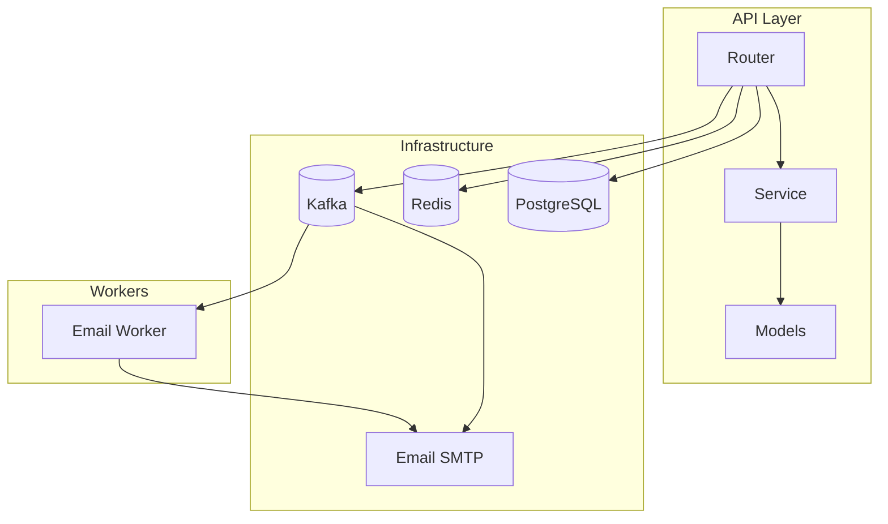
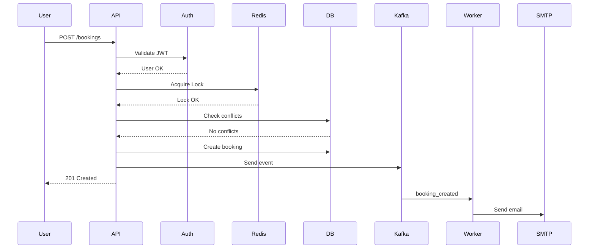

# Booking API Service

REST API для бронирования залов кинотеатра с местами.

## На текущий момент

### Реализовано

| Компонент | Описание |
|-----------|---------|
| Auth | Регистрация, авторизация (JWT) |
| Users | CRUD пользователей (admin) |
| Halls | CRUD залов (admin) |
| Seats | CRUD мест (admin, bulk создание) |
| Bookings | Создание, отмена, список бронирований |
| Availability | Проверка доступных слотов (с кешированием) |

### В разработке

- Email уведомления (Kafka + Worker)
- Docker + CI/CD
- Тесты

## Tech Stack

FastAPI • PostgreSQL • Redis • Kafka • JWT • Docker

## Быстрый старт

### Установка

```bash
python -m venv venv
source venv/bin/activate
pip install -e .
cp .env.example .env
```

### Запуск (нужен Docker)

```bash
docker-compose up -d postgres redis kafka
alembic upgrade head
uvicorn app.main:app --reload
```

### Создание администратора

```bash
python -m app.scripts.create_admin --email admin@test.com --password secret123
```

### API Endpoints

| Метод | Путь | Описание |
|-------|------|----------|
| POST | /api/v1/auth/signup | Регистрация |
| POST | /api/v1/auth/login | Вход (JWT) |
| GET | /api/v1/users/me | Профиль |
| GET | /api/v1/halls/ | Список залов |
| POST | /api/v1/halls/ | Создать зал |
| GET | /api/v1/halls/{id}/seats/ | Места в зале |
| POST | /api/v1/halls/{id}/seats/bulk | Bulk создание мест |
| POST | /api/v1/bookings/ | Создать бронирование |
| GET | /api/v1/bookings/ | Мои бронирования |
| GET | /api/v1/bookings/halls/{id}/availability | Доступные слоты |

## Документация API

http://localhost:8000/docs

## Архитектура



## Flow бронирования


